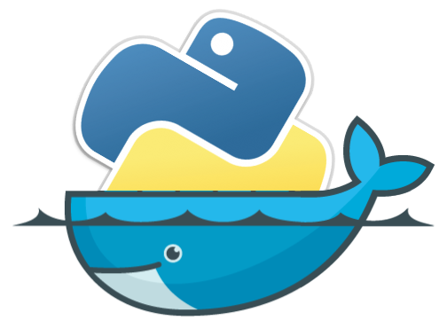

<!--
*** Thanks for checking out the Best-README-Template. If you have a suggestion
*** that would make this better, please fork the repo and create a pull request
*** or simply open an issue with the tag "enhancement".
*** Thanks again! Now go create something AMAZING! :D
-->


<!-- PROJECT LOGO -->
<br />
<p align="center">
  <a href="https://github.com/AlejandroUPC/pythonmicroservices">
    
  </a>

  <h3 align="center">Python Microservices</h3>

  <p align="center">
    Architecture for Python microservices: Docker, Django, Flask, Kafka.
    <br />
  </p>
</p>


<!-- TABLE OF CONTENTS -->
<details open="open">
  <summary>Table of Contents</summary>
  <ol>
    <li>
      <a href="#about-the-project">About The Project</a>
      <ul>
        <li><a href="#built-with">Built With</a></li>
      </ul>
    </li>
    <li>
      <ul>
        <li><a href="#prerequisites">Prerequisites</a></li>
        <li><a href="#installation">Installation</a></li>
      </ul>
    </li>
    <li><a href="#usage">Usage</a></li>
    <li><a href="#roadmap">Roadmap</a></li>
    <li><a href="#license">License</a></li>
    <li><a href="#contact">Contact</a></li>
  </ol>
</details>


<!-- ABOUT THE PROJECT -->
## About The Project

A small project trying to simulate an architecture that captures and processes in real time customer transactions that purchase 
from supermarkets.
There are mainly three modules:

* Backoffice: Holds data for customer, clients, and transactions.
* Customer Metrics: Captures transactions and calculates KPIs for every customer.
* Shop Metrics: Captures transactions amd calculates KPIs for every supermarket.

After recorded on the backoffice database all the transactions are sent to a Kafka Broker, and each microservice consumes them in a different group from the same topic, picture helps to understand:
<p align="center">

</p>

### Built With

The frameworks used to build this project are:

* [Django](https://www.djangoproject.com/)
* [Flask](https://flask.palletsprojects.com/en/1.1.x/)
* [Docker](https://www.docker.com)
* [Kafka](https://kafka.apache.org)


### Prerequisites

Docker must be installed

### Installation

1. Clone the repo
   ```sh
   git clone https://github.com/AlejandroUPC/pythonmicroservices.git
   ```
3. Start the docker-compose
   ```sh
   docker-compose up -d
   ```


<!-- USAGE EXAMPLES -->
## Usage

Once Docker is up and running three supermarkets and customers are created with ids 1,2,3.
Note that in order to create valid transactions when using the JSON example, the sp_owner must match to an existing superkarmet_id and thecustomer_id must match to an existing customer_id in the respective databases:

```json
{
    "transaction_id": 2,
    "item_id": 123,
    "pay_method": 0,
    "price": 1111.1,
    "item_cnt": 4,
    "bill_id": 594,
    "transaction_dt": "2021-03-24",
    "customer_id": 2,
    "sp_owner": 2
}
```

### Backoffice

* Django API runs on port 8000.
* SQL database runs on port 3306.

### Customer metrics

* SQL database runs on port 3307.

### Shop metrics

* SQL database runs on port 3308


<!-- ROADMAP -->
## Roadmap

Implement a web application that updates the data live showing some metrics and fancy plots (probably nodejs)


<!-- LICENSE -->
## License

Distributed under the MIT License. See `LICENSE` for more information.


<!-- CONTACT -->
## Contact


Alejandro Martínez - [Linkedin](https://www.linkedin.com/in/alejandro-martinez-otal/) - amartinezotal@gmail.com

Project Link: [zTypeBot](https://github.com/AlejandroUPC/pythonmicroservices)